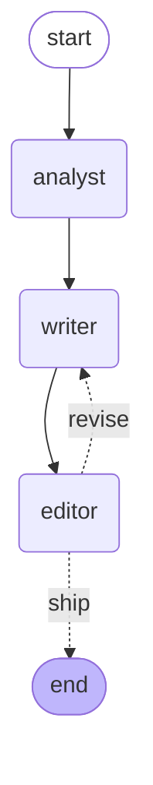

# Rare-Earth Intelligence Desk

A small multi-agent pipeline that reads a rare-earth-elements news item and produces a sharp, **investable** brief written for a venture-capital audience — not a generic "supply chain crisis" summary.

Four agents pass a single shared document down an assembly line: a **Researcher** gathers live context from the web, an **Analyst's** findings are drafted into a brief by a **Writer**, and an **Editor** scores that brief against a rubric and sends weak drafts back for revision. The whole thing is wired together as a [LangGraph](https://langchain-ai.github.io/langgraph/) state machine with a real quality-control loop.

> **Try it in 30 seconds, no API key required** — see [Quickstart → Demo mode](#demo-mode-no-api-key) below.

---

## What it produces

Given a hypothetical headline — *"Helix Minerals claims 99% pure dysprosium via novel bio-separation process"* — the desk returns:

> # Bio-Bugs Won't Save the Dysprosium Supply Chain
> *Helix Minerals' bench-scale purity claim is scientifically plausible — and strategically irrelevant for the next five years*
>
> **What it actually is:** A chemistry milestone wearing an engineering costume. Purity is the easy number; the bench-scale-only result with no throughput disclosed means this is years from the pilot scale where government capital and offtakes actually flow.
>
> **The investable angle:** Don't bet on the microbes — track the funding architecture. The real signal is whether Helix files for a DOE Title XVII-style loan or lands an offtake...

The skeptical thesis isn't scripted — it emerges because the Analyst flags the bench-scale caveat and the Editor refuses to ship a draft that goes soft on it.

---

## Architecture

The pipeline is a directed graph with one cycle: the **editor → writer** revision loop. This diagram is generated directly from the compiled graph (see [Regenerating the diagram](#regenerating-the-diagram)).



**The shared state.** Every agent reads from and writes to a single typed object — the `Brief` (a Pydantic model). It starts as a raw news item and fills up as it travels: the Analyst appends `findings`, the Writer sets `draft`, the Editor sets `editor_score` and `editor_feedback`. There is no separate message-passing layer; the `Brief` *is* the blackboard, and reading its definition top-to-bottom is effectively reading the pipeline.

**The loop.** After the Editor scores a draft, a router decides: a score at or above the pass threshold ships; anything lower goes back to the Writer **with the Editor's feedback attached**, so the rewrite is targeted. A revision cap (`MAX_DRAFTS`) guarantees the loop always terminates.

---

## How it works

| Agent | File | Job |
| --- | --- | --- |
| Analyst | `analyst.py` | Searches the web to verify and enrich the story, returns structured `findings` across three lenses: geopolitical, technical, pricing. |
| Writer | `writer.py` | Synthesises findings into a VC brief in a fixed format; on a revision, folds in the Editor's critique. |
| Editor | `editor.py` | Scores the draft 0–10 against a rubric and returns actionable feedback. The pass bar lives in one constant, `PASS_THRESHOLD`. |
| Orchestrator | `desk.py` | Wires the agents into a LangGraph `StateGraph` and runs the revision loop. |

Two patterns do most of the work:

- **Structured output.** Agents are instructed to answer as JSON, which is then parsed and validated against a Pydantic schema. Sloppy model output (a bad enum value, a malformed object) is caught at the boundary instead of corrupting the report downstream.
- **Behaviour lives in prompts, not code.** Each agent's expertise and output format is defined in a plain-English system prompt. Tuning the analysis or changing the report's structure is a prompt edit, not a code change.

---

## Quickstart

### Demo mode (no API key)

Runs the entire pipeline against a cached, pre-recorded run — including a live revision loop where the Editor rejects the first draft and accepts the second. The graph, router, and loop all execute for real; only the model calls are replaced.

```bash
git clone <your-repo-url>
cd rare-earth-desk

python -m venv venv
# Windows:  venv\Scripts\activate
# macOS/Linux:  source venv/bin/activate

pip install langgraph anthropic pydantic python-dotenv

python desk.py --demo
```

### Live mode (real web search + model)

```bash
# Create a .env file in the project root:
echo ANTHROPIC_API_KEY=sk-ant-your-key-here > .env

python desk.py
```

Live mode calls Claude with the web-search tool enabled, so each run costs a few cents and takes ~30–60 seconds.

---

## Design notes

**Why four agents, not ten.** An earlier blueprint for this called for a three-layer, ~10-agent hierarchy (separate geopolitical, metallurgical, and pricing specialists; dedicated ingestion agents per source; a vector database for historical context). That is a reasonable *production* architecture and a poor *prototype*: more system prompts to tune, more failure points, higher latency and cost, and a setup burden that stops anyone from running it. Multi-agent structure earns its keep here in exactly one place — the Editor/Writer critic loop, where "try again, here's what was wrong" genuinely improves the output. The three analytical lenses are handled by one well-prompted Analyst rather than three agents, because at this scale the split adds coordination cost without adding insight. The clean upgrade path (fan the Analyst out into parallel specialists) is preserved, but not paid for up front.

**State-first design.** The `Brief` schema was defined before any agent. Because the data structure encodes the whole flow, adding the Editor between the Writer and the finish line required no rewiring — it just reads `draft` and writes `editor_feedback`.

---

## Limitations & next steps

This is a prototype, and a few things are deliberately scoped out:

- **No ingestion yet.** It runs on one hardcoded sample item. A real desk would pull from keyless sources (RSS feeds, GDELT, SEC EDGAR full-text search). *Planned.*
- **No triage stage.** Every item goes straight to full analysis. A cheap front-door agent (e.g. on a smaller, faster model) to filter noise and bucket by theme is the natural next addition. *Planned.*
- **Findings are leads, not verified facts.** Web-search results are model-summarised, which is why every finding carries a confidence rating and a source link. Treat them as starting points for diligence.
- **Pricing is only as current as web search.** There is no live market-data feed for spot prices (Nd/Dy/Tb), which sit behind paywalled providers.
- **Structured output uses JSON-in-text parsing.** Robust to the common failure modes (markdown fences, stray preamble), but the bulletproof approach is forced tool use. *Planned hardening.*

---

## Tech stack

- **Python**
- **[LangGraph](https://langchain-ai.github.io/langgraph/)** — graph-based agent orchestration with cycles
- **[Anthropic API](https://docs.claude.com/)** (Claude Sonnet 4.6) with the server-side web-search tool
- **[Pydantic](https://docs.pydantic.dev/)** — typed shared state and output validation

---

## Project structure

```
rare-earth-desk/
├── brief.py      # Shared state (the "Brief") + the sample news item
├── analyst.py    # Web research → findings across 3 lenses
├── writer.py     # Findings → VC brief
├── editor.py     # Scores the draft, returns feedback (the quality bar)
├── desk.py       # LangGraph orchestrator: agents + the revision loop
├── demo.py       # Cached run for offline --demo mode
└── README.md
```

---

## Regenerating the diagram

The architecture diagram is produced from the compiled graph itself:

```python
from desk import build_desk
print(build_desk(demo=True).get_graph().draw_mermaid())
```

Paste the output into a ```mermaid block to keep the README in sync with the code.
